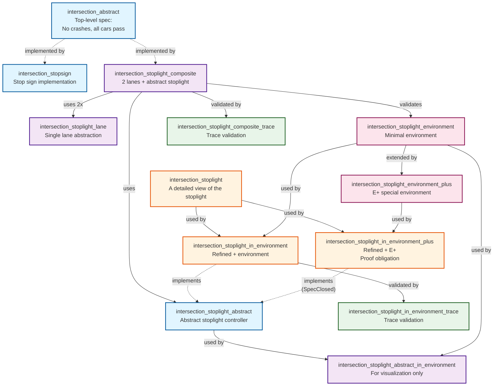

# Decomposition in TLA+ with Stoplights

## Checking

This project is built with nix, so `nix-build` will model check all specifications, check all proofs, and generate all graphs.

## Decomposition in General

This repo shows how we can use decomposition to avoid state explosion when model checking a system with TLA+/TLC.
We depend on the Decomposition Theorem described thoroughly in [Open Systems in TLA](https://lamport.azurewebsites.net/pubs/abadi-open.pdf), [A Science of Concurrent Programs, section 8.2](https://lamport.azurewebsites.net/tla/science.pdf), and [Verification of a Multiplier: 64 Bits and Beyond](https://lamport.azurewebsites.net/pubs/kurshan-multiplier.pdf).

Decomposition is nontrivial, so normally we specify and model check an entire system.
However, it may be desirable when model checking becomes intractable due to state explosion.
Instead of checking the entire system, we demonstrate that a system composed up of abstract components has the property of interest, and then check a refined definition of some or all of the components (nearly) independently.

Components usually cannot be checked _entirely_ independently, because they typically only make sense as part of a larger system.
They may not be able to act at all without some spurring or they may depend on other parts of the larger ecosystem behaving in some specific manner.
To account for this, we check our refined spec composed against a specifications of a minimal environment, akin to a test harness.

We need to show a few things with this minimal environment:

  - It implements our abstract composite system.
    This demonstrates that the environment acts consistently and is not making guarantees that are not implied by the actual system.
  - It and the refined component spec together implement our abstract component's spec.
  - A special version of it and the refined spec together implement our abstract component's spec (but all ignoring fairness).
    This special version forces the component to take one more step after an illegal step from the environment.
    This additional requirement breaks the otherwise circular reasoning from the other two steps.
    Refer to Lamport's linked publications for a much better and thorough treatment of this topic.

In multiple steps, we don't consider the full specification, `F`, but the closure of the spec, `C(F)`.
The closure of the spec is the specification ignoring all fairness definitions.

All of these obligations can be demonstrated with model checking.

## The TLA+ Modules

There are over a dozen TLA+ modules, some of which are purely illustrative.
This particular problem is so easy, that model checking is trivial.
However, this structure would work for a more challenging problem.

### intersection_abstract

This module is the most abstract definition of an intersection of two one-way roads.
For this specification, we show that cars do not crash and that all cars eventually make it through the intersection.
Because properties are transitive through refinement, any specification that implements this one, also has these properties.
### intersection_stopsign

This particular spec exists simply to demonstrate how abstract our `intersection_abstract` spec is.
Not only does the abstract perspective work for stoplights, but for stop signs as well.

### intersection_stoplight_lane

This spec is the most abstract definition of cars in a single lane that obey a stoplight.
They do nothing alone, so there are no properties that are checked or proven.

### intersection_stoplight_abstract

This spec acts as the most abstract definition of our stoplight component.
It simply alternates which lane is green, and holds both lights red while the final cars clear before activating the alternate green.

However, it's meaningless alone (no cars pass through), so it has no properties that are checked or proven.

### intersection_stoplight_environment

This is the minimal definition of an environment for a stoplight to operate in.
It is a simplified view of the two lanes together.
Alone, it does nothing, so it has no properties that are checked or proven.

### intersection_stoplight_composite

This spec is the abstract definition of an intersection that uses a stoplight.
It composes two lanes and an abstract stoplight.
We demonstrate that that this implements `intersection_abstract`, which implies that cars cannot crash and will always eventually make it through the intersection.
We also demonstrate that it implements the `intersection_stoplight_environment`, which validates that it is a legitimate environment definition.

### intersection_stoplight_composite_trace

This spec acts as a way that we can be skeptical of success.
While the fairness/liveness specification for these components gives us a high confidence that the system works as expected, for a system with only safety properties, it's quite easy to define a system that does nothing: nothing is always safe.
This module defines a single behavior, and checks that it implements the composite.
A single trace for an ideal path shows that the ideal path is at least _possible_, which increases our confidence that we've specified what we intended.

### intersection_stoplight_abstract_in_environment

This specification is purely illustrative for graph generation.
Since our composite specification and our refined specifications will have too many states to render useful state graphs, this level of abstraction can often be useful for understanding the system.

### intersection_stoplight

This spec is the refined definition of a stoplight that we would like to show also prevents crashes and eventually allows all cars to pass through, but without the state explosion of checking it in a fully composed system.
The state explosion is trivial in this example, but it still reduces it.

We introduce three components: a central controller and two lights, each connected by two wires.
The central sends TRUE over its output if it wants the light to go green, and FALSE if it wants it to go red.
The light sends back TRUE over its output if it's light is currently green.
This return signal is critical for ensuring that the light actually turns green before switching (otherwise, cars in that lane might not actually get a turn and get stuck), and that it knows it's safe to activate the other signal.

Again, this component doesn't do anything useful alone, because no cars will pass through the intersection.

### intersection_stoplight_in_environment

This spec combines both the environment and the refined definition of the stoplight.
We demonstrate that this implements the abstract stoplight.

### intersection_stoplight_environment_plus

This spec is our special version of the stoplight environment, where the environment is allowed to be false for one step.
Due to model checking constraints, we do use proof here, just to confirm that our manual translation of ~Env!Init and ~Env!Next are correct (they cannot be model checked directly as written).

The environment doesn't do anything useful on its own.

### intersection_stoplight_in_environment_plus

As our final proof obligation, we show that composing the special environment with our refined spec implements our abstract spec (ignoring fairness for both).

### intersection_stoplight_in_environment_trace

This trace also acts as a sanity check to ensure that our system _can_ take an idealized path, just like `intersection_stoplight_composite_trace`.
